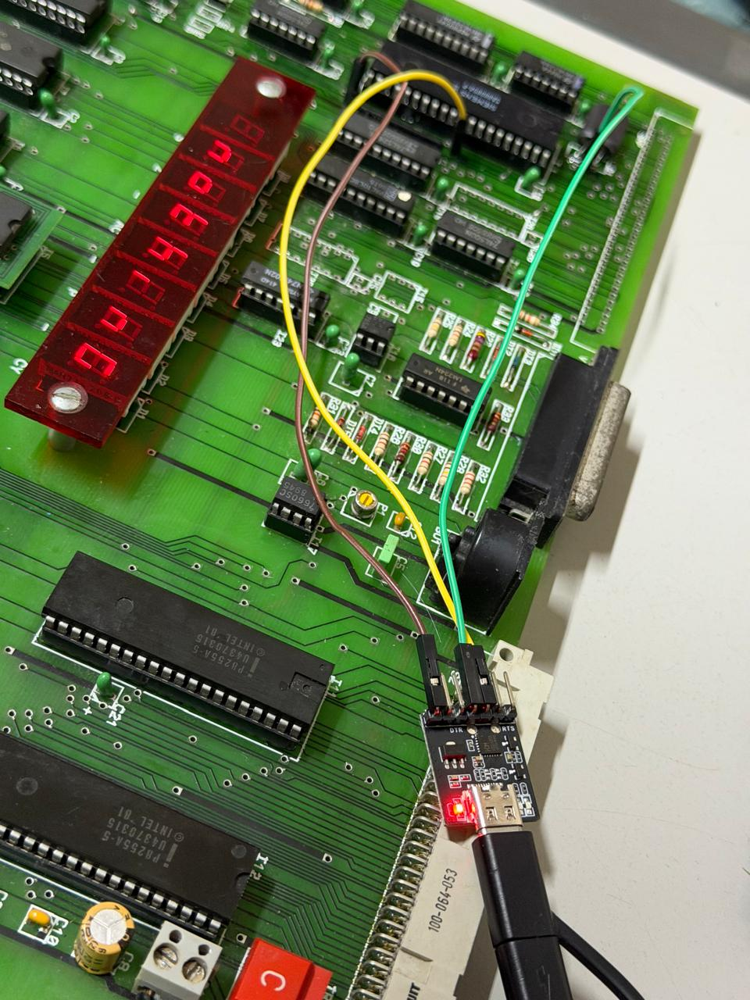
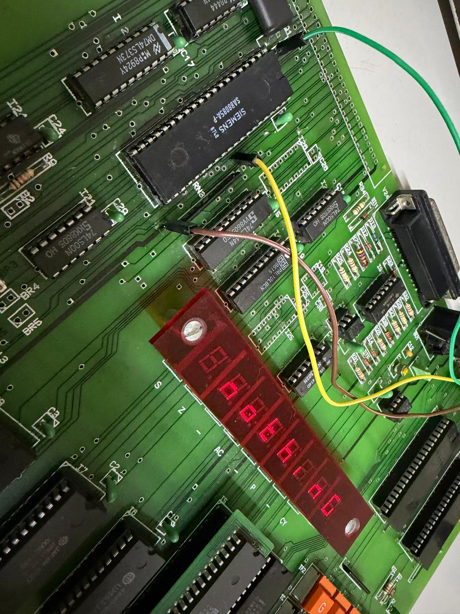

# PROFI-5E Serial Loader + Development Toolchain

A development chain for the **PROFI-5E**, an Intel 8085A single-board
trainer computer built by Ingenieur-Büro Kammerer (Germany, 1984–2011): a
serial loader that runs from the board's expansion EPROM socket, and a
Python client that sends programs to it over USB-serial from a PC.

Full project rationale, current status, and repository layout: **[PROJECT.md](PROJECT.md)**.
All hardware facts (memory map, I/O, keyboard, DIL switches, monitor ROM API,
serial framing): **[docs/Profi5E_Hardware_Reference.md](docs/Profi5E_Hardware_Reference.md)**.

## What it does

1. **`loader/loader.asm`** — burned to an EPROM in the expansion socket
   (2000h). On boot, listens on the serial line (SID/SOD, via the monitor
   ROM's own `RXCHAR`/`TXCHAR` routines) for a framed binary, writes it to
   RAM, checksums it, and runs it.
2. **`tools/profi5e_load.py`** — PC-side client. Sends a `.bin` with a
   sync/header/checksum frame over a serial port, waits for ACK/NAK, and
   (by default) tells the board to run it immediately.
3. **`tools/profi5e_build.py`** — assembles an `examples/*.asm` source for a
   chosen RAM address, so its output lines up with the `--addr` given to
   `profi5e_load.py`.
4. **`examples/`** — small demo programs (7-segment display output) that
   exercise the loader end to end.

Not yet started: a BIN→WAV encoder for the monitor's cassette-tape format,
as a hardware-free alternative loading path (see PROJECT.md Roadmap).

## Wiring: connecting a USB-TTL adapter to SID/SOD

The loader talks over the 8085's own **SID**/**SOD** pins directly, not
through the board's V.24 DB9 connector (see Hardware Reference §9 for the
electrical reasoning). A plain 5V USB-TTL adapter (TXD/RXD/GND, no level
shifter needed) connects like this:

- adapter **TXD** → **SID**
- adapter **RXD** → **SOD**
- adapter **GND** → board **GND**

**I9 (the op-amp that drives the physical V.24 connector) shares its input
with SID.** Left in its socket, it can end up fighting the adapter's own
drive on that same line — not electrically clean, even though this
project's own board has run this way in practice without issue. Since I9
is socketed, not soldered, the cleanest fix costs nothing: **pull it out**
(reversible any time by plugging it back in). See Hardware Reference §9
for the full reasoning and two more conservative alternatives (lifting
only I9's pin 14, or leaving it seated).

This project's own board uses solder-in pin headers at accessible PCB via
points as permanent tap points, so the adapter connects/disconnects with
jumper wires instead of a fresh solder joint every time:

<p>
  
  
</p>

Green = SID, yellow = SOD, brown = GND, in both photos. Exact via locations
are specific to this board revision — use the photos as a reference for the
*technique* (solder a short pin into a via carrying the signal you need, so
future connections are a jumper-wire plug rather than a new solder joint
each time), not as exact coordinates to replicate blindly.

There are two ways to use this project, needing different things installed:

## Just want to use it? (no assembler needed)

Burn a **prebuilt** loader image, then load the **prebuilt** example
programs — nothing here needs `asl`/`p2bin`, only Python.

**Requirements:** Python 3 with [`pyserial`](https://pypi.org/project/pyserial/)
(`pip install pyserial`); a PROFI-5E with the expansion EPROM socket
populated and a 5V USB-TTL serial adapter wired to SID/SOD (Hardware
Reference §9).

1. Burn one of the prebuilt loader images to an EPROM in the expansion
   socket, matching the chip you actually have:
   - `loader/loader_2764.bin` — 8 KB, for a **2764** (the chip this socket
     officially documents, jumper B1 pins 3-4).
   - `loader/loader_27128.bin` — 16 KB, for a **27128** instead (not
     officially documented for this socket, but confirmed working — see
     Hardware Reference §7; mainly useful if, like this project's own board,
     you have 27128s on hand and few/no 2764s).
2. Set the board's DIL switches (Hardware Reference §6 for the full table):
   - **Switch 5 = OFF** (no serial handshake)
   - **Switch 6 = OFF** (V.24/serial output, not Centronics)
   - **Switch 7/8** = desired baud rate, must match `--baud` below
   - **Switch 4 = OFF** for auto-boot into the loader on power-up (otherwise
     start it manually — Hardware Reference §5.3)
3. Load a prebuilt example:
   ```sh
   python tools/profi5e_load.py examples/hiworld.bin --port COM4 --addr 8000
   python tools/profi5e_load.py examples/scroll_text.bin --port COM4 --addr 8000
   ```
   (One at a time — both are built for the same default address, 8000h.)

## Want to write or modify a program? (needs the assembler)

Editing `loader.asm`, `examples/*.asm`, or writing your own `.asm` all need
`asl` + `p2bin` on `PATH` to turn source into a `.bin`. New to the command
line, or don't have them installed? **[docs/Setup_Tutorial.md](docs/Setup_Tutorial.md)**
is a from-scratch, no-experience-assumed walkthrough (includes a prebuilt
`asl`/`p2bin` download, so you don't have to compile them yourself either).

Rebuild the loader (only needed if you change `loader.asm` — the prebuilt
`.bin`s above are already this exact source):

```sh
cd loader
./build.sh          # -> loader.bin, 8 KB, for a 2764
./build.sh 27128    # -> loader.bin, 16 KB, for a 27128 instead
```

Build and load your own program (or a modified example):

```sh
python tools/profi5e_build.py examples/hiworld.asm --addr 8000
python tools/profi5e_load.py examples/hiworld.bin --port COM4 --addr 8000
```

**The `--addr` passed at build time and at load time must be the same
value.** 8085 code is not position-independent: `profi5e_build.py --addr`
controls what address the code is assembled for (baked into internal
jumps/calls), while `profi5e_load.py --addr` only controls where the board
writes the incoming bytes. A mismatch loads and ACKs successfully, but the
program jumps to the wrong places the moment it runs. `profi5e_build.py`
prints the matching load command after every build as a reminder.

## Third-party material

The code and documentation authored in this repository are MIT-licensed
(see [LICENSE](LICENSE)).

`rom/Profi5E.BIN` (a dump of this board's own monitor ROM) and the scanned
manuals/schematics under `docs/*.pdf` are copyrighted material from
Ingenieur-Büro Kammerer, not authored by this project. They're included here
for personal reference, interoperability, and preservation of an otherwise
hard-to-find piece of retrocomputing hardware documentation — not licensed
for redistribution or reproduction elsewhere.
